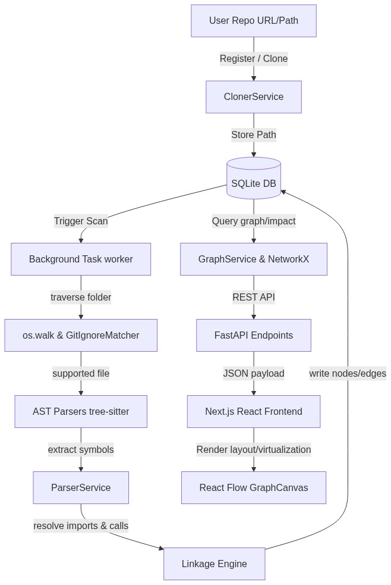
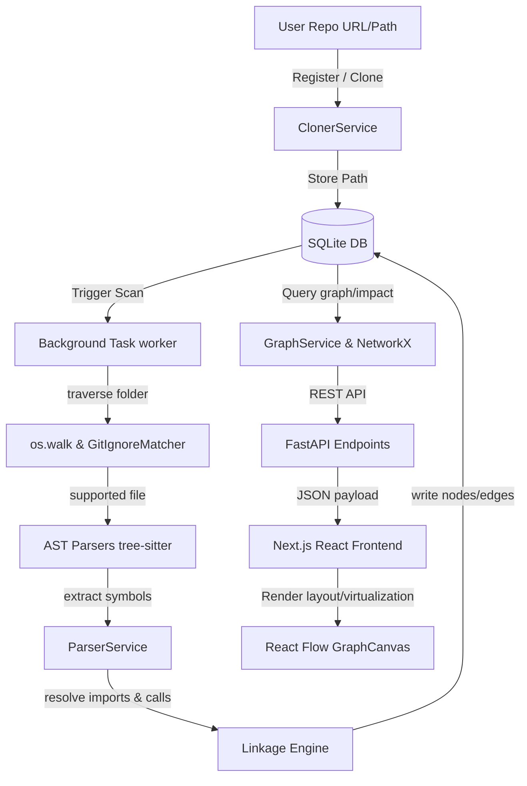
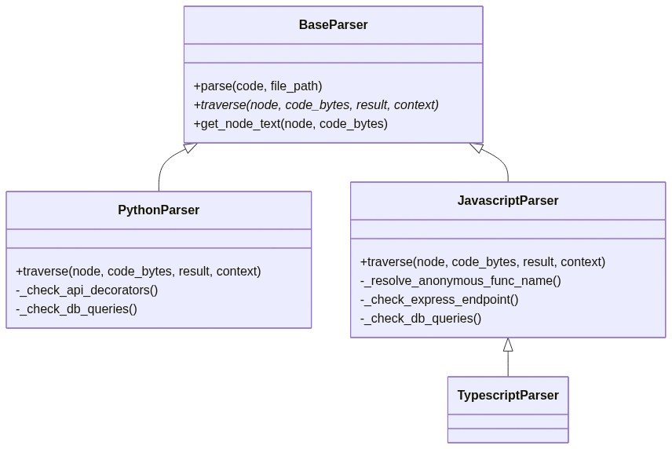
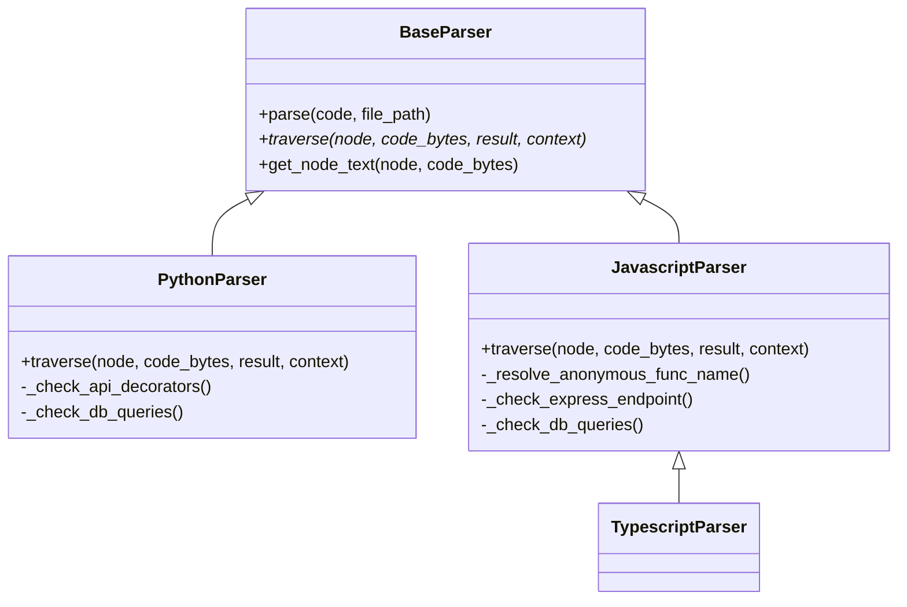
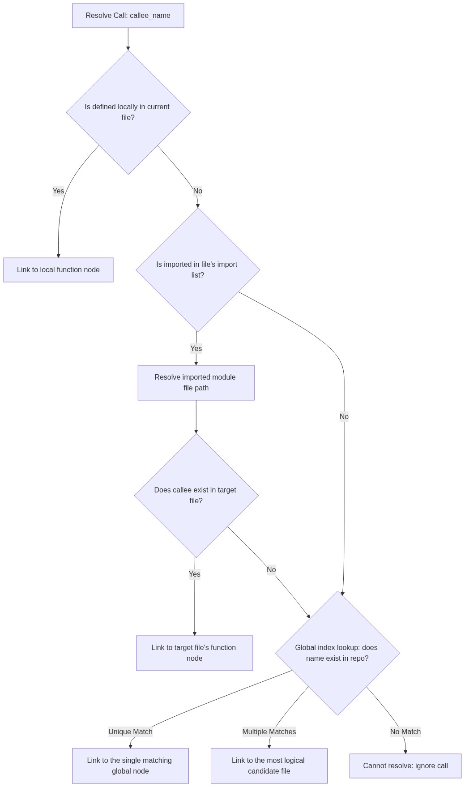
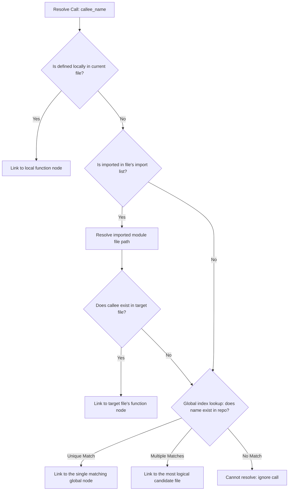

# Repo-to-Graph System Architecture & Algorithms Guide

This document provides a comprehensive explanation of how the **Repo-to-Graph** application analyzes source repositories, extracts code symbols, builds a call graph, calculates impact analysis scores, and renders interactive visual layouts.

---

## 1. System Architecture & Data Flow

<b>Raw Mermaid Syntax</b>

### Database Schema
The graph data is persisted in a local SQLite database file `repo_to_graph.db` using SQLAlchemy models:
*   **Repository**: Stores metadata (`id`, `name`, `url`, `local_path`).
*   **Scan**: Tracks background jobs (`id`, `repository_id`, `status` [pending/scanning/completed/failed], `error_message`, `created_at`, `completed_at`).
*   **Node**: Holds individual code symbols (`id`, `repository_id`, `name`, `type` [repo, folder, file, class, function, api, table], `file_path`, `start_line`, `end_line`, `properties` [JSON]).
*   **Edge**: Defines relationships (`id`, `repository_id`, `source_id`, `target_id`, `type` [CONTAINS, IMPORTS, CALLS, CALLS_API, USES], `properties` [JSON]).

---

## 2. Scanning & Codebase Traversal

The scanning pipeline is orchestrated by [ParserService.scan_repository](file:///Users/mozammil/personal/antigravity/my%20git%20repos/repo-to-graph/backend/app/services/parser.py#L89-L408).

### Folder Traversal & GitIgnore Compliance
1.  **os.walk Traversal**: Starts at the repository root and walks the folder tree recursively.
2.  **Ignored Directories**: Standard build and dependency folders are ignored in-place (`dirs[:] = pruned_dirs`):
    `{".git", "node_modules", "venv", ".venv", "env", "__pycache__", ".next", "dist", "build", ".idea", ".vscode", "out"}`
3.  **GitIgnoreMatcher**: Reads the root `.gitignore` file and compiles matching patterns using python's `fnmatch` rules:
    *   *Case 1 (Relative prefix matching)*: Rules starting with `/` (e.g. `/log`) are matched relative to the repository root.
    *   *Case 2 (Relative substring matching)*: Rules containing a `/` (e.g. `docs/*.pdf`) are matched against relative paths.
    *   *Case 3 (Global name matching)*: Rules with no `/` (e.g. `*.log`) match file or folder names anywhere in the tree.

---

## 3. Concrete Syntax Tree (CST) Parsing

Supported files (`.py`, `.js`, `.jsx`, `.ts`, `.tsx`) are parsed using language-specific wrappers around **tree-sitter**.

<b>Raw Mermaid Syntax</b>

For each file, the parser recursively walks the syntax tree and extracts:
*   **Classes**:
    *   *Python*: `class_definition` AST nodes.
    *   *JavaScript/TypeScript*: `class_declaration` AST nodes.
*   **Functions & Methods**:
    *   *Python*: `function_definition` AST nodes.
    *   *JavaScript/TypeScript*: `function_declaration`, `method_definition`, `arrow_function`, and anonymous `function_expression` nodes. (Anonymous functions assigned to variables, assignments, or object properties are resolved to their nearest variable name identifier).
*   **API Endpoints**:
    *   *Python*: Parses decorator expressions (e.g. `@app.get("/users")`) using regular expressions to extract the HTTP method and path string.
    *   *JavaScript/TypeScript*: Parses Express routing call expressions (e.g. `app.post("/register", ...)`).
*   **Database Queries**:
    *   Looks for SQL command patterns (`SELECT`, `INSERT`, `UPDATE`, `DELETE`) inside string literals in the AST using regular expressions, capturing the table name and operation.

---

## 4. Linkage & Dependency Graph Resolution

Once the file structure, classes, functions, and metadata are extracted, the linkage phase builds the relationship edges.

### A. Containment (`CONTAINS`)
*   `repo` node $\rightarrow$ top-level folders & root files.
*   `folder` node $\rightarrow$ nested files & folders.
*   `file` node $\rightarrow$ classes & standalone functions declared in the file.
*   `class` node $\rightarrow$ class methods.

### B. REST APIs & Databases (`CALLS_API`, `USES`)
*   **API Route to Function**: An API route node (ID: `{repo_id}:api:{method}:{path}`) is linked to a function node if the decorator/registration line number is located within the function's start and end line boundary.
*   **Function to DB Table**: A function is connected to a table node (ID: `{repo_id}:table:{table_name}`) with a `USES` edge if the SQL query string matches the function's line boundaries.

### C. Import Resolution (`IMPORTS`)
Imports (ES6, CommonJS `require`, Python imports) are translated to physical paths by [_resolve_import_file_path](file:///Users/mozammil/personal/antigravity/my%20git%20repos/repo-to-graph/backend/app/services/parser.py#L409-L450):
1.  Dots in modules are mapped to path separators (e.g., `services.db` $\rightarrow$ `services/db`).
2.  The engine generates candidate filenames based on relative levels (`../`, `./`) and typical file extensions (`.py`, `.js`, `.ts`, `.tsx`, `/__init__.py`).
3.  It matches candidates against the list of all registered repository files. If found, an `IMPORTS` edge is drawn from the importer file to the target file.

### D. Function Call Resolution (`CALLS`)
When a function body contains a function call (e.g. `callee_name()`), the engine maps it to the target function node via [_resolve_callee_node_id](file:///Users/mozammil/personal/antigravity/my%20git%20repos/repo-to-graph/backend/app/services/parser.py#L451-L492) using a three-tiered lookup strategy:

<b>Raw Mermaid Syntax</b>

---

## 5. NetworkX Graph Algorithms

The backend service [GraphService](file:///Users/mozammil/personal/antigravity/my%20git%20repos/repo-to-graph/backend/app/services/graph.py) instantiates a `networkx.DiGraph` to perform advanced analysis.

### Refactoring Impact Analysis
Calculates the downstream dependencies and upstream propagation blast radius of a code element:
1.  **Upstream Propagation (Ancestors)**: Queries `nx.ancestors(G, node_id)` by traversing directed edges backwards to locate all transitive callers and depending classes/files.
2.  **Downstream Dependencies (Descendants)**: Queries `nx.descendants(G, node_id)` by traversing directed edges forwards to find all elements the target node calls or depends on.
3.  **Refactoring Impact Score**: Computed using a weighted formula based on the category of affected upstream components:

$$\text{Impact Score} = 5 \times N_{\text{files}} + 3 \times N_{\text{classes}} + 1 \times N_{\text{functions}}$$

*   *Low Impact*: Score $\le 10$
*   *Medium Impact*: $10 < \text{Score} \le 30$
*   *High Impact*: Score $> 30$ (representing a widespread risk if refactored).

### Circular Dependency Detection
Identifies loops that could cause circular imports or stack overflow recursions:
*   **Circular Imports**: Constructs a subgraph containing only `IMPORTS` edges and runs `networkx.simple_cycles()` to return cycles of files that import each other.
*   **Recursion Loops**: Constructs a subgraph containing only `CALLS` edges and runs `networkx.simple_cycles()` to highlight recursive function calls.

---

## 6. Frontend Layout & Canvas Optimization

Rendering large codebase graphs efficiently in the browser is handled by [GraphCanvas.tsx](file:///Users/mozammil/personal/antigravity/my%20git%20repos/repo-to-graph/frontend/components/graph/GraphCanvas.tsx) and `@xyflow/react` (React Flow).

### A. Rendering Performance & Viewport Virtualization
*   **onlyRenderVisibleElements={true}**: Renders only the nodes and edges within the user's viewport clipping boundaries. This prevents browser lag on large graphs.
*   **High-Level View Projection**: For repositories exceeding 600 nodes, the backend hides fine-grained functions/classes and projects their calls to the file level (e.g. `fileA.py` calls `fileB.py`). This prevents rendering bottlenecks.
*   **Edge Animation Optimization**: Dash animations are disabled on graphs with more than 150 edges to conserve GPU and browser CPU threads, enabling only upon node hover.

### B. Auto-Layout Grid
Nodes are distributed horizontally into structured, thematic columns:

| Column X-Coordinate | Node Types |
| :--- | :--- |
| **X = 0** | API Endpoints |
| **X = 300** | Folders |
| **X = 600** | Files |
| **X = 900** | Classes |
| **X = 1200** | Functions & Methods |
| **X = 1500** | Database Tables |

Within each folder, files, nested classes, and their respective methods are clustered vertically to keep logical relationships visually coherent.

### C. Orthogonal Edge Staggering
To prevent vertical overlaps of orthogonal connector lines:
1.  A custom edge component `DistributeStepEdge` computes the step path.
2.  The vertical midpoint `centerX` is shifted dynamically:

$$\text{centerX} = \text{midX} + \left( \left(\text{Hash}(\text{id}) \pmod 9\right) - 4 \right) \times (\Delta X \times 0.05)$$

This distributes parallel paths side-by-side, maintaining high legibility.

### D. Legend Filter Isolation & Layering
Clicking a specific node type in the legend (e.g., viewing only `API` to `Function` calls) isolates those components. Since standard layout coordinates would leave large empty gaps, the canvas triggers a **layered column layout**:
1.  It isolates the filtered elements.
2.  It groups them into topological levels (layers) dynamically to minimize backward edge lines.
3.  It centers the columns vertically to produce a focused architectural flow diagram.
